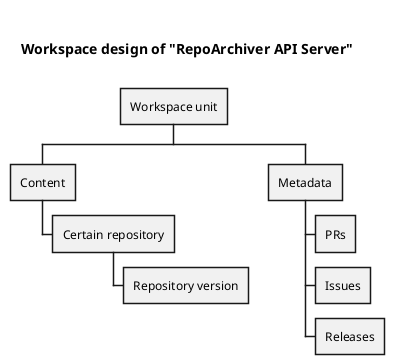

```plantuml
@startwbs
title

Workspace design of "RepoArchiver API Server"

end title

* Workspace unit
** Content
*** Certain repository
**** Repository version
** Metadata
*** PRs
*** Issues
*** Releases
@endwbs
```